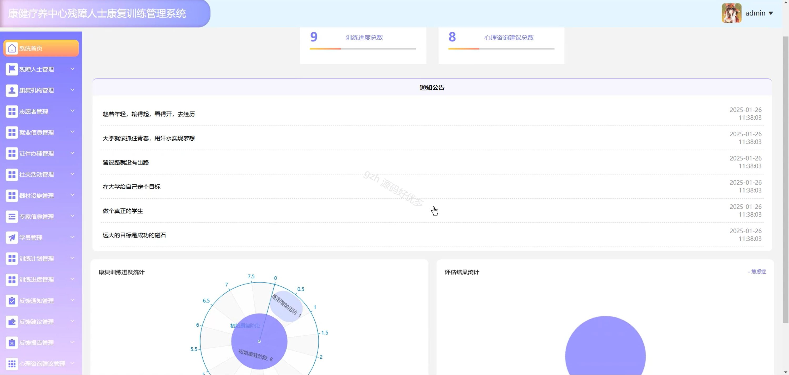

# springbootA214D
springbootA214D康健疗养中心残障人士康复训练管理系统+LW+PPT
 
## 查看主页获取源码

### 一、关键词
残障人士管理、康复机构管理、训练辅助管理

### 二、作品包含
源码+数据库+设计文档万字+ppt+全套环境和工具资源+本地部署教程

### 三、项目技术
前端技术：Html、Css、Js、Vue2.0、Element-ui 
后端技术：Java、SpringBoot2.0、MyBatis

### 四、运行环境（以下版本亲测，其他版本未知，请自测）
开发工具：IDEA/eclipse  + VSCODE

数据库：MySQL5.7（最低要5.7版本）

数据库管理工具：Navicat10以上版本

环境配置软件： JDK1.8 + Maven3.6.3

前端Nodejs：14

浏览器：谷歌浏览器

### 五、项目介绍
项目编号：springbootA214D

康健疗养中心残障人士康复训练管理系统可实现对残障人士康复训练全流程管理，以提升康复训练效率与质量。

角色：管理员、用户、康复机构、志愿者

管理员：系统首页、残障人士管理、康复机构管理、志愿者管理、就业信息管理、证件办理管理、社交活动管理、器材设施管理、专家信息管理、学员管理、训练计划管理、训练进度管理、反馈通知管理、反馈建议管理、反馈报告管理、心理咨询建议管理、心理支持管理、就业申请管理、就业记录管理、资源预约管理、专家预约管理、训练辅助管理、心理评估管理、试题管理、系统管理、参与评估管理、个人中心。

用户：首页、就业信息、社交活动、器材设施、专家信息、心理评估、通知公告、个人中心、修改密码、聊天记录、训练计划、训练进度、反馈通知、反馈建议、心理咨询建议、就业申请、就业记录、资源预约、专家预约、参与评估记录、我的收藏。

康复机构：系统首页、器材设施管理、专家信息管理、学员管理、训练计划管理、训练进度管理、反馈通知管理、反馈建议管理、反馈报告管理、心理咨询建议管理、资源预约管理、专家预约管理、试题管理、心理评估管理、参与评估管理、个人中心。

志愿者：系统首页、社交活动管理、训练计划管理、反馈通知管理、反馈报告管理、心理支持管理、训练辅助管理、个人中心。

### 六、运行截图

